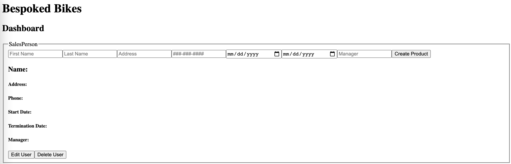

# Getting Started with Bespokes-Bikes

Bespoked Bikes is a web application that I created over two days. The app is able to read, update, and delete data much like a CRUD app.

This project was bootstrapped with [Create React App](https://github.com/facebook/create-react-app).

To start off, first clone the repo from the main branch. 

Then run
### `npm install`

to install the required libraries. 

In this project, I utilized Firebase sdk as my database so that read, update, and delete data. 

After running npm install, 

### `npm start`

to start running the app.

If you run into any issues, try removing the **node_modules** folder and reinstalling it with npm install.

Once the app is running, it should look something like this:

### `Limitations`
Currently, I was only able to implement a couple of the features that were asked due to time limitations.

I was able to figure out how to successfully add, update, and delete a new salesPerson and product. 

I could do the same for customers and sales if I had more time. 
I also couldn't figure out how to find duplicate items through Firebase since it requires a specific get function that I was unable to run without errors
Also, didn't get enough time to work on the sales commission chart and the code is a bit messy and needs refactoring

In order to add a user, just fill out all the fields.
In order to update a user, fill out the fields for the person/thing you want to update and then click "Edit User"
Lastly, in order to delete, simply press the delete button

**IMPORTANT** After every action, refresh the browser window since it sends a new request to firebase every time an action is done

